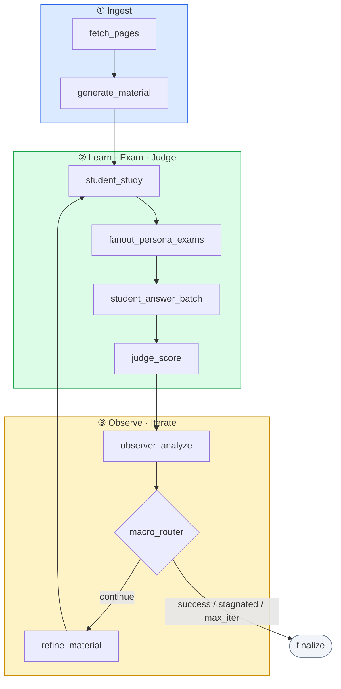
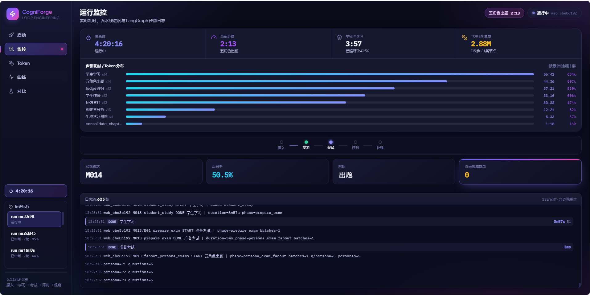
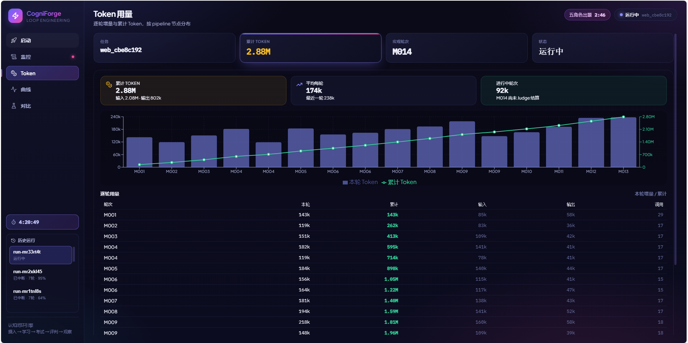
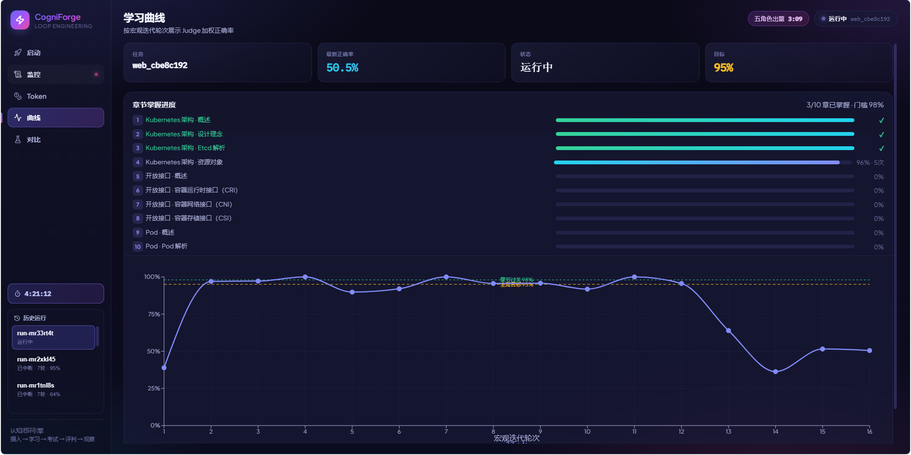
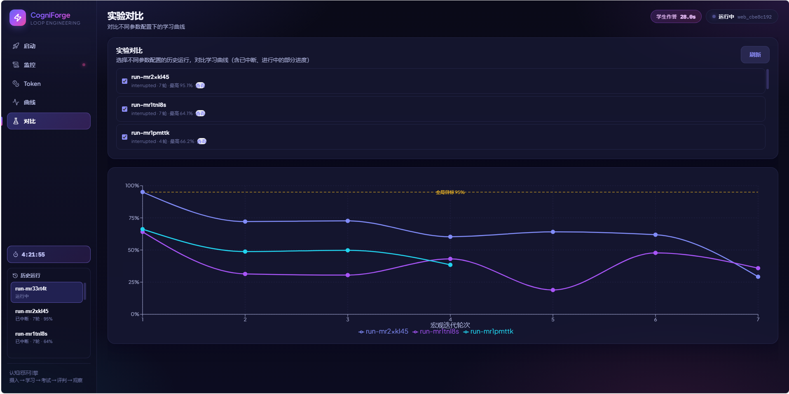
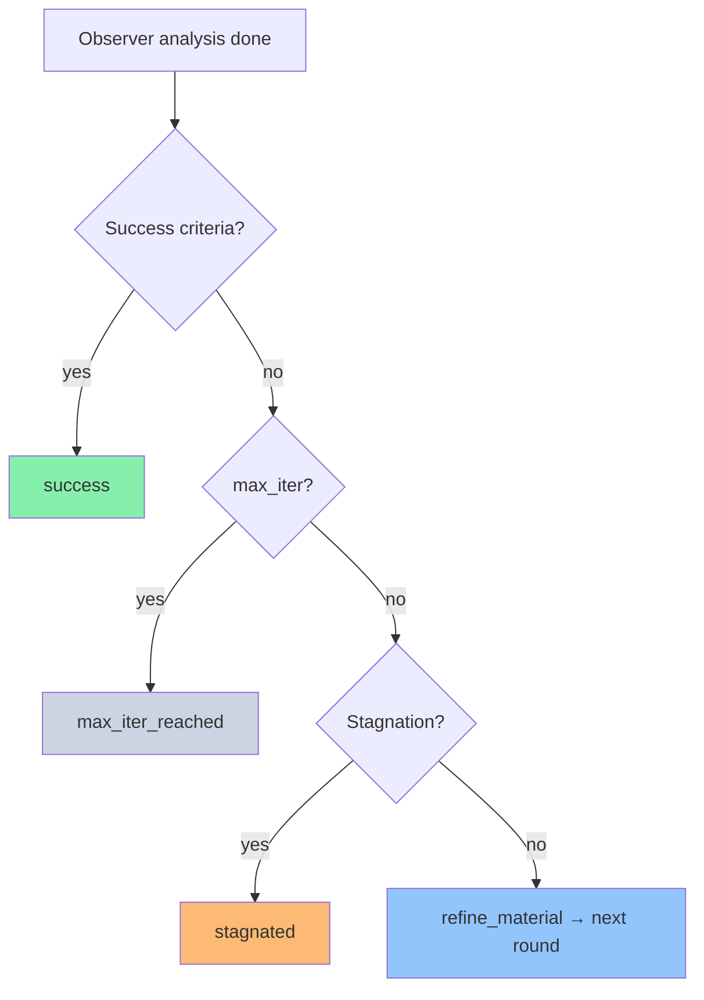

<div align="center">

# CogniForge

**Loop Engineering reference implementation — iterative learning & mastery verification**

[](https://www.python.org/downloads/)
[](https://github.com/langchain-ai/langgraph)
[](LICENSE)

[Quick Start](#quick-start) · [Architecture](#architecture) · [Configuration](#configuration) · [Loop Engineering](docs/loop-engineering.md)

</div>

---

## About

**CogniForge** is a production-oriented reference implementation of [Loop Engineering](docs/loop-engineering.md) for **knowledge acquisition and closed-book mastery verification**. It orchestrates a macro loop—ingest → study → exam → judge → observe → refine—using LangGraph, with a nested **PersonaExam** micro loop for question generation and self-check.

The goal is not one-shot summarization. CogniForge runs **auditable, multi-round loops** that progressively improve understanding, note quality, and exam performance under realistic constraints (closed-book answers, evidence-only judging, curriculum windows).

---

## Features

| Capability | Description |
|------------|-------------|
| **Dual termination** | Business success criteria + hard `MAX_MACRO_ITER` cap |
| **Separated roles** | Student / Personas vs. Judge vs. Observer use distinct prompts and models |
| **Adaptive curriculum** | `curriculum_level` unlocks more source pages when accuracy ≥ threshold |
| **Adaptive difficulty** | `difficulty_level` (0–4) rises or falls based on round performance |
| **Checkpointing** | Redis LangGraph checkpoints (falls back to in-memory) |
| **Stagnation detection** | Exits when accuracy plateaus (`stagnated`) |
| **Web Console** | URL input, presets, live logs, timing, learning curves, run comparison |
| **Fault isolation** | Single persona exam failure does not abort the macro loop |

---

## Loop Engineering mapping

| Loop Engineering principle | CogniForge implementation |
|----------------------------|---------------------------|
| Dual termination | `TARGET_ACCURACY` + `MIN_MACRO_ITER` + `MAX_MACRO_ITER` |
| Generate / evaluate separation | Student & Personas vs. **Judge B** vs. **Observer C** |
| Resumable state | Redis checkpoint (`MemorySaver` fallback) |
| Convergence detection | `stagnation_rounds` + `stagnation_min_delta` |
| Nested loops | **Macro Loop** + **PersonaExam Micro Loop** |
| Failure isolation | Failed nodes route to `finalize`; persona errors are logged and skipped |

---

## Architecture

### Macro loop



### Agents

| Agent | Role |
|-------|------|
| **Student A** | Phased study, bounded notes, closed-book answers |
| **Personas P1–P5** | Diverse question styles (difficulty weights in `config/personas.yaml`) |
| **Judge B** | Independent, evidence-only scoring |
| **Observer C** | Analyzes study notes only; writes archival `observer_report_iter_N.md` (not fed back to Student) |
| **Material** | Handbook generation and weak-topic refinement |

### Adaptive learning policy

After each `judge_score` round:

| State | Behavior |
|-------|----------|
| `curriculum_level` | Unlocks cumulative source pages (`CURRICULUM_PAGES_PER_ROUND` per level). Advances when weighted accuracy ≥ `CURRICULUM_ADVANCE_ACCURACY` (default 0.85). |
| `difficulty_level` | Range 0–4. +1 if accuracy ≥ `DIFFICULTY_ADVANCE_ACCURACY` (0.90); −1 if &lt; `DIFFICULTY_RETREAT_ACCURACY` (0.50). |
| `weak_topics` | Top wrong-answer `topic_tag` counts from Judge; focused in later exams when difficulty ≥ 1. |
| `refine_material` | Adds new pages to study material only when `curriculum_advanced=True`. |

Implementation: [`src/tools/learning_policy.py`](src/tools/learning_policy.py)

---

## Web Console

Visual control plane: **URL input · parameter presets · live SSE logs · step timing · learning curves · run comparison · cooperative stop**.

### Screenshots

#### Runtime monitoring

Track an active run end-to-end: macro round (`M014`), total elapsed time, current step, and cumulative token usage. The pipeline bar shows progress through **ingest → study → exam → judge → reinforce**, with per-step duration and token breakdown (student study, persona question generation, judge scoring, student answers, material refinement, observer analysis). The live log streams LangGraph step events with timestamps for debugging.



#### Token usage

Inspect LLM cost per macro round: cumulative vs. per-round tokens, input/output split, average per round, and in-progress round totals before judge settlement. The bar + line chart plots round consumption against cumulative growth; the table lists input, output, and call counts for each iteration.



#### Learning curve & chapter progress

See weighted judge accuracy across macro iterations against the **95% main target** and **98% chapter pass** thresholds. Chapter mastery cards show per-chapter status (mastered, in progress with attempt count, or not started) as the curriculum advances through handbook sections.



#### Run comparison

Overlay learning curves from multiple historical runs (including interrupted or in-progress jobs) to compare parameter presets and judge/scoring configurations. Select runs from the checklist and view accuracy trajectories on the same chart with the global target line.



### Local development (recommended)

```bash
pip install -r requirements.txt
cp .env.example .env   # set at least one LLM API key

# Terminal 1 — API
PYTHONPATH=. python -m src.api.server

# Terminal 2 — frontend (hot reload)
cd web && npm install && npm run dev
```

| Service | URL |
|---------|-----|
| UI (dev) | http://localhost:5173 |
| API | http://localhost:8080 |
| UI (single-server) | http://localhost:8080 after `cd web && npm run build` |

Windows shortcut: `.\scripts\run-console.ps1`

### Docker

```bash
cp .env.example .env
docker compose up -d redis console
# open http://localhost:8080
```

### Console capabilities

| Panel | Description |
|-------|-------------|
| **Launch** | Seed URLs, learning goal, experiment label; dev/prod parameter presets |
| **Live log** | SSE stream of pipeline logs and judge progress |
| **Timing** | Per-step duration (`step_start` / `step_timing` events) |
| **Learning curve** | Weighted accuracy by macro iteration with target line |
| **Compare** | Overlay curves from historical runs |
| **Stop** | Cooperative cancel (`POST /api/runs/{id}/stop`) |

Run metadata is stored under `outputs/.registry/` (gitignored).

---

## Quick Start

### Prerequisites

- Python **3.11+**
- At least one supported LLM API key (see [Configuration](#configuration))
- (Optional) Redis 7+ for checkpointing and resume
- (Optional) Node.js 18+ for Web Console frontend dev server

### Docker Compose (CLI task)

```bash
git clone <repository-url>
cd <repository-name>

cp .env.example .env
# edit .env — add your API key(s); never commit this file

docker compose up --build
```

Run a specific task:

```bash
docker compose run --rm cogniforge \
  --urls https://docs.python.org/3/tutorial/index.html \
  --goal "Master core Python tutorial concepts" \
  --task-id demo-001
```

### Local CLI

```bash
python -m venv .venv

# Linux / macOS
source .venv/bin/activate
export PYTHONPATH=.

# Windows PowerShell
.\.venv\Scripts\Activate.ps1
$env:PYTHONPATH = "."

cp .env.example .env
pip install -r requirements.txt

python -m src.main \
  --urls https://docs.python.org/3/tutorial/index.html \
  --goal "Master core Python tutorial concepts" \
  --task-id demo-001
```

| Flag | Description |
|------|-------------|
| `--urls` | Seed URL(s); handbook-style crawl discovers sibling pages |
| `--goal` | Learning objective |
| `--task-id` | Output directory and checkpoint namespace |
| `--thread-id` | LangGraph thread for resume (defaults to `task-id`) |
| `--no-crawl` | Fetch exact URLs only |

Resume a previous run:

```bash
python -m src.main --urls … --task-id demo-001 --thread-id demo-001
```

---

## Configuration

**Configuration sources**

1. The primary `Settings` object — environment variables / `.env`, with Pydantic defaults in [`src/config.py`](src/config.py).
2. [`config/settings.yaml`](config/settings.yaml) — read **separately** by specific subsystems (exam batch sizes, stagnation, some learning thresholds). It is *not* merged into `Settings`, so it does not override `.env`; the two cover different keys.

> **Local dev tip:** `settings.yaml` ships with lighter exam counts (50 / 30 questions) for faster iteration. Override via `.env` for production-scale runs.

Copy [`.env.example`](.env.example) to `.env` and fill in secrets. For a dev-focused template see [`.env.local.example`](.env.local.example).

### LLM providers

| `LLM_ROUTER` | Provider |
|--------------|----------|
| `litellm` | Recommended — routes by model prefix |
| `minimax` | MiniMax OpenAI-compatible API |
| `openrouter` | OpenRouter |
| `anthropic` | Anthropic |
| `openai` | OpenAI-compatible endpoint |

Model presets: [`config/models.yaml`](config/models.yaml)

### Core loop variables

| Variable | Default | Description |
|----------|---------|-------------|
| `TARGET_ACCURACY` | `0.95` | Weighted accuracy target |
| `MIN_MACRO_ITER` | `3` | Minimum macro rounds before success |
| `CONSECUTIVE_PASS_ROUNDS` | `2` | Consecutive rounds at/above target |
| `MAX_MACRO_ITER` | `1000` | Hard upper bound |
| `CLOSED_BOOK_EXAM` | `1` | Student answers from notes only |
| `JUDGE_EVIDENCE_ONLY` | `1` | Judge sees evidence chunks only |
| `EVIDENCE_CAP_SCORE` | `0.78` | Score cap when evidence is weak |

### Curriculum & difficulty

| Variable | Default | Description |
|----------|---------|-------------|
| `CURRICULUM_PAGES_PER_ROUND` | `12` | Pages unlocked per curriculum level |
| `CURRICULUM_ADVANCE_ACCURACY` | `0.85` | Accuracy to advance curriculum |
| `DIFFICULTY_ADVANCE_ACCURACY` | `0.90` | Accuracy to increase difficulty |
| `DIFFICULTY_RETREAT_ACCURACY` | `0.50` | Accuracy to decrease difficulty |

### Exam scale (`settings.yaml` → `exam`)

| Key | Dev default | Description |
|-----|-------------|-------------|
| `first_round_total` | `50` | Questions in macro round 0 |
| `focused_round_total` | `30` | Questions in later rounds |
| `judge_batch_size` | `20` | Judge batch size |
| `questions_per_persona` | `5` | Per-persona question quota |

### Docker task environment

| Variable | Description |
|----------|-------------|
| `LOOP_URLS` | Comma-separated seed URLs |
| `LOOP_GOAL` | Learning goal |
| `LOOP_TASK_ID` | Task / output id |
| `LOOP_THREAD_ID` | Optional resume thread |

Legacy `LEARN_LOOP_*` variables are accepted for backward compatibility.

---

## Outputs

Artifacts are written to `outputs/{task_id}/` (gitignored):

| File | Description |
|------|-------------|
| `study_material*.md` | Generated / refined handbook |
| `study_notes.md` / `study_notes_{chapter_id}.md` | Student notes (in-place update per chapter) |
| `qa_scored_iter_N.json` | Scored Q&A |
| `judge_report_iter_N.md` | Judge report |
| `observer_report_iter_N.md` | Observer analysis (archival) |
| `final_summary.json` | Terminal status and metrics |

| `status` | Meaning |
|----------|---------|
| `success` | Met min rounds + consecutive pass |
| `stagnated` | Accuracy plateau detected |
| `max_iter_reached` | Hit `MAX_MACRO_ITER` |
| `failed` | Runtime error |
| `cancelled` | User interrupt |

---

## Termination logic



---

## Project layout

```
.
├── config/           # personas, rubric, models, settings.yaml
├── src/
│   ├── main.py       # CLI entry
│   ├── api/          # FastAPI console backend
│   ├── graph/        # LangGraph nodes, routers, subgraphs
│   ├── models/       # LLM factory
│   └── tools/        # crawl, RAG, learning_policy
├── web/              # React console (Vite)
├── tests/
├── scripts/
├── docker-compose.yml
├── Dockerfile
└── Dockerfile.console
```

---

## Development

```bash
pip install -r requirements.txt pytest
PYTHONPATH=. pytest tests/ -q
python scripts/check-python.py
python scripts/check-redis.py   # optional
```

---

## Security

- **Never commit** `.env`, API keys, or `outputs/` run artifacts.
- `.env` is listed in [`.gitignore`](.gitignore). Use [`.env.example`](.env.example) as the template only.
- If a key was ever exposed, **rotate it** at your provider before publishing.
- Respect target websites' terms of service when crawling.

See [SECURITY.md](SECURITY.md) for reporting vulnerabilities.

---

## FAQ

<details>
<summary><strong>Why is accuracy low in early rounds?</strong></summary>

By design: closed-book exams, evidence-only judging, note length caps, and progressive curriculum simulate a real learner. Improvement comes from macro loops and material refinement—not one-shot memorization.
</details>

<details>
<summary><strong>What is <code>weak_topics</code>?</strong></summary>

After each judge round, wrong-answer <code>topic_tag</code> values are counted; the top tags become <code>weak_topics</code> and inform focused questioning when <code>difficulty_level ≥ 1</code>.
</details>

<details>
<summary><strong>Why <code>stagnated</code>?</strong></summary>

The last N rounds (default 3) showed accuracy deltas below 1%. Tune <code>stagnation_rounds</code> / <code>stagnation_min_delta</code> in <code>config/settings.yaml</code>.
</details>

<details>
<summary><strong>Redis unavailable?</strong></summary>

Falls back to in-memory checkpoint (<code>MemorySaver</code>). Tasks complete but cannot resume across process restarts. Docker: <code>REDIS_URL=redis://redis:6379/0</code>.
</details>

<details>
<summary><strong>Runs are slow locally?</strong></summary>

Use Web Console dev presets, or lower <code>first_round_total</code> / <code>focused_round_total</code> in <code>settings.yaml</code>. Persona exams currently run sequentially; total LLM calls scale with questions × personas × macro rounds.
</details>

---

## Contributing

1. Fork the repository and create a feature branch.
2. Keep changes focused; match existing code style.
3. Run <code>PYTHONPATH=. pytest tests/ -q</code> before opening a PR.
4. Do not include secrets, personal URLs, or run artifacts in commits.

---

## License

[MIT](LICENSE)

---

## Acknowledgments

- [LangGraph](https://github.com/langchain-ai/langgraph)
- [LiteLLM](https://github.com/BerriAI/litellm)
- [Loop Engineering](docs/loop-engineering.md) methodology
