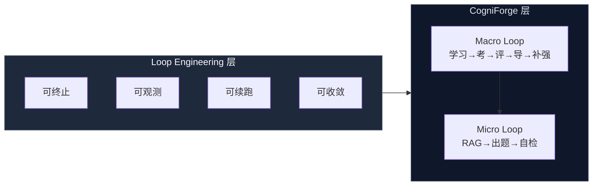
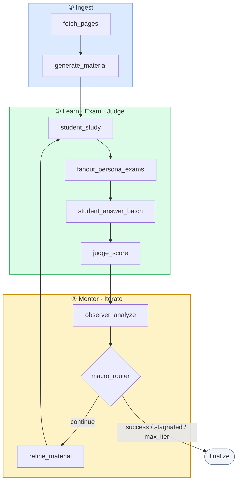
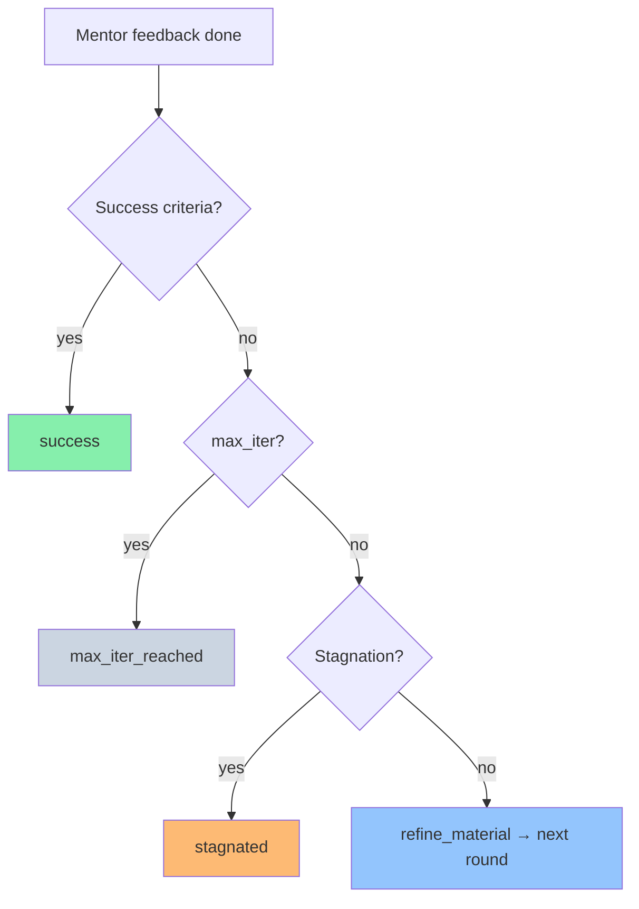

<div align="center">

# CogniForge

**Loop Engineering 参考实现 · 迭代认知闭环**

[](https://www.python.org/downloads/)
[](https://github.com/langchain-ai/langgraph)
[](LICENSE)

[快速开始](#quick-start) · [Loop Engineering 方法论](../loop-engineering.md) · [架构](#architecture) · [配置](#configuration)

</div>

---

## About

**CogniForge**（认知锻造）是 [Loop Engineering](../loop-engineering.md) 方法论在**知识掌握与验证**领域的生产级参考实现：用 LangGraph 编排「摄入 → 学习 → 考试 → 评判 → 导师 → 补强」宏观闭环，并在出题环节嵌入 PersonaExam 微观闭环。

它解决的不是「让 LLM 把资料复述一遍」，而是：

> **在无先验前提下，通过可审计的多轮 Loop，逐步提高理解深度、笔记质量与闭卷表现。**

---

## Loop Engineering 在本项目中的落地

CogniForge 将 [Loop Engineering](../loop-engineering.md) 的工程原则映射为可运行代码：

| Loop Engineering 原则 | CogniForge 实现 |
|-------------------------|-----------------|
| 双重终止 | `TARGET_ACCURACY` + `MIN_MACRO_ITER` + `MAX_MACRO_ITER` |
| 生成 / 评估分离 | Student / Persona 与 **Judge B**、**Mentor C** 分模型、分 Prompt |
| Checkpoint 续跑 | Redis LangGraph Checkpoint（降级 MemorySaver） |
| 收敛检测 | `stagnation_rounds` + `stagnation_min_delta` → `stagnated` |
| 分层 Loop | **Macro Loop**（学习轮次）+ **PersonaExam Micro Loop**（出题自检） |
| 异常隔离 | 单 Persona 出题失败不终止；节点级 `failed` 路由至 `finalize` |



---

## Architecture

### 宏观闭环（Macro Loop）



### 多 Agent 协作

| Agent | 职责 |
|-------|------|
| **Student A** | 阶段化学习、有限笔记、闭卷作答 |
| **Personas P1–P5** | 差异化出题（难度权重可配） |
| **Judge B** | Evidence-only 独立评分 |
| **Mentor C** | 答题诊断、习惯纠正、方法论与下轮规划 |
| **Material** | 资料生成与薄弱点补强 |

Persona 定义：[`config/personas.yaml`](config/personas.yaml) · 评分标准：[`config/rubric.yaml`](config/rubric.yaml)

---

## Quick Start

### Prerequisites

- Python **3.11+**
- 任一支持的 LLM API Key（见 [Configuration](#configuration)）
- （可选）Redis 7+ — Checkpoint 与断点续跑

### Docker Compose

```bash
git clone <repository-url>
cd loop-engineering/learn-loop

cp .env.example .env
docker compose up --build
```

指定任务：

```bash
docker compose run --rm cogniforge \
  --urls https://docs.python.org/3/tutorial/index.html \
  --goal "Master core Python tutorial concepts" \
  --task-id demo-001
```

### Local

```bash
cd loop-engineering/learn-loop
python -m venv .venv
source .venv/bin/activate   # Windows: .\.venv\Scripts\Activate.ps1

cp .env.example .env
pip install -r requirements.txt
export PYTHONPATH=.         # Windows: $env:PYTHONPATH="."

python -m src.main \
  --urls https://docs.python.org/3/tutorial/index.html \
  --goal "Master core Python tutorial concepts" \
  --task-id demo-001
```

| Flag | Description |
|------|-------------|
| `--urls` | Seed URL(s); handbook-style crawl discovers sibling pages |
| `--goal` | Learning objective |
| `--task-id` | Output directory & checkpoint namespace |
| `--thread-id` | LangGraph thread for resume (defaults to `task-id`) |
| `--no-crawl` | Fetch exact URLs only |

Resume:

```bash
python -m src.main --urls … --task-id demo-001 --thread-id demo-001
```

---

## Configuration

Precedence: **environment (`.env`)** → [`config/settings.yaml`](config/settings.yaml) → defaults.

### LLM providers

| `LLM_ROUTER` | Provider |
|--------------|----------|
| `litellm` | Recommended — routes by model prefix |
| `minimax` | MiniMax OpenAI-compatible API |
| `openrouter` | OpenRouter |
| `anthropic` | Anthropic |
| `openai` | OpenAI-compatible |

Presets: [`config/models.yaml`](config/models.yaml)

### Loop & learning policy

| Variable | Default | Description |
|----------|---------|-------------|
| `TARGET_ACCURACY` | `0.95` | Weighted accuracy target |
| `MIN_MACRO_ITER` | `3` | Minimum macro rounds before success |
| `CONSECUTIVE_PASS_ROUNDS` | `2` | Consecutive rounds at/above target |
| `MAX_MACRO_ITER` | `1000` | Hard upper bound |
| `CLOSED_BOOK_EXAM` | `1` | Answers from notes only |
| `JUDGE_EVIDENCE_ONLY` | `1` | Judge sees evidence chunks only |
| `CURRICULUM_PAGES_PER_ROUND` | `12` | Pages unlocked per macro round |

Full template: [`.env.example`](.env.example)

### Docker task environment

| Variable | Description |
|----------|-------------|
| `LOOP_URLS` | Comma-separated URLs |
| `LOOP_GOAL` | Learning goal |
| `LOOP_TASK_ID` | Task / output id |
| `LOOP_THREAD_ID` | Optional resume thread |

Legacy `LEARN_LOOP_*` variables are still accepted for backward compatibility.

---

## Outputs

Artifacts under `outputs/{task_id}/`:

| File | Description |
|------|-------------|
| `study_material*.md` | Generated / refined material |
| `study_notes_iter_N.md` | Learner notes per round |
| `qa_scored_iter_N.json` | Scored Q&A |
| `judge_report_iter_N.md` | Judge report |
| `observer_report_iter_N.md` | Mentor feedback |
| `final_summary.json` | Terminal status |

| `status` | Meaning |
|----------|---------|
| `success` | Met min rounds + consecutive pass |
| `stagnated` | No meaningful accuracy delta |
| `max_iter_reached` | Hit `MAX_MACRO_ITER` |
| `failed` | Runtime error |
| `cancelled` | User interrupt |

---

## Termination logic



---

## Project layout

```
learn-loop/          # package directory — CogniForge (rename to cogniforge/ optional)
├── config/
├── src/
│   ├── main.py
│   ├── graph/        # LangGraph state, nodes, routers, subgraphs
│   ├── models/       # LLM factory
│   └── tools/        # crawl, RAG, learning_policy
├── tests/
├── docker-compose.yml
└── Dockerfile
```

---

## Development

```bash
pip install -r requirements.txt pytest
PYTHONPATH=. pytest tests/ -q
python scripts/check-python.py
python scripts/check-redis.py   # optional
```

---

## FAQ

<details>
<summary><strong>Why is accuracy low in early rounds?</strong></summary>

By design: closed-book exams, evidence-only judging, note length caps, and curriculum unlocking simulate a real learner. Improvement comes from macro loops and mentor feedback—not one-shot memorization.
</details>

<details>
<summary><strong>Why <code>stagnated</code>?</strong></summary>

The last N rounds (default 3) showed accuracy deltas below 1%. Tune `stagnation_rounds` / `stagnation_min_delta` in `config/settings.yaml`.
</details>

<details>
<summary><strong>Redis unavailable?</strong></summary>

Falls back to in-memory checkpoint (`MemorySaver`). Tasks complete but cannot resume. Docker: `REDIS_URL=redis://redis:6379/0`.
</details>

---

## License

[MIT](LICENSE) — respect target sites' terms of service; never commit API keys.

---

## Acknowledgments

- [LangGraph](https://github.com/langchain-ai/langgraph)
- [LiteLLM](https://github.com/BerriAI/litellm)
- [Loop Engineering](../loop-engineering.md) methodology
